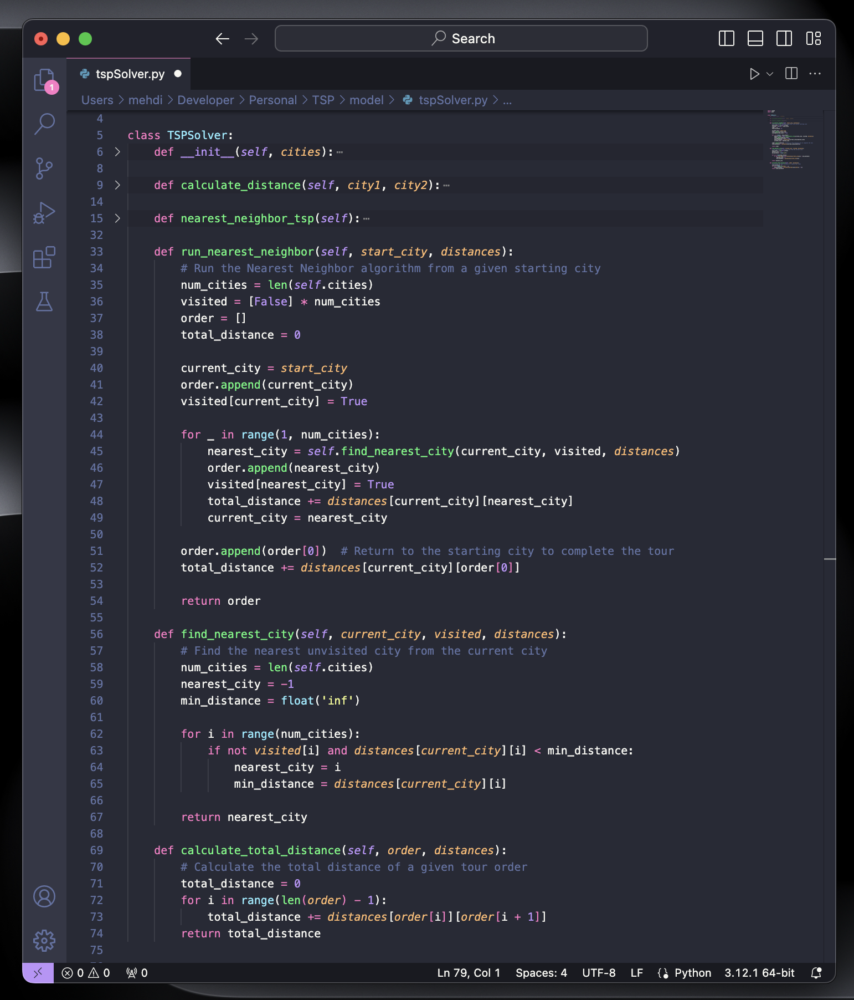

# Traveling Salesman Problem (TSP) Visualization
This Python project uses Tkinter for creating a GUI to visualize the **Traveling Salesman Problem (TSP)** solution, following the *Model-View-Controller (MVC)* architecture.


## Table of Contents
- [Introduction](#introduction)
- [MVC Architecture](#mvc-architecture)
- [Dependencies](#dependencies)
- [Usage](#usage)
- [Contributing](#contributing)
- [License](#license)

## Introduction
The project aims to visualize the TSP solution (using a Tkinter-based graphical user interface). It generates a specified number of random cities, applies the `nearest neighbor algorithm` to find the optimal path, and visualizes the results.

## MVC Architecture
The project's code is organized into three main classes, following the **Model-View-Controller (MVC)** architecture:

- **Model (TSPSolver):** 
   - Implements the nearest neighbor algorithm to solve the TSP.
   - Represents the model in the MVC architecture, handling data and business logic, such as calculating the TSP solution.
     
- **View (TSPView):** 
   - Takes care of drawing cities and the TSP solution on the canvas.
   - Acts as the view in the MVC architecture, dealing with the user interface and visualization.

- **Controller (TSPController):** 
   - Initializes the Tkinter window.
   - Manages the GUI components such as the canvas, sliders, and labels.
   - Handles city initialization, TSP solving, and GUI updates.
   - Acts as the controller in the MVC architecture, managing user input, updating the model, and triggering visual updates on the view.

<details>
 <summary>Project's Source Tree</summary>

```
.
├── LICENSE
├── README.md
│
├── controller
│   └── tspController.py
├── main.py
├── model
│   ├── city.py
│   └── tspSolver.py
└── view
    ├── tspView.py
    └── view.py
```
</details>

<p>  </p>

## Dependencies
To run this project, ensure you have the following dependencies installed:

1. **Python 3.x:** If you don't have Python installed, download and install it from the official [Python website](https://www.python.org/downloads/). Make sure to add Python to your system PATH during installation.

2. **Tkinter:** Tkinter is included with most Python installations. To check if Tkinter is available on your system, open a terminal or command prompt and run the following command:
   ```bash
   python -m tkinter
   ```
   If Tkinter is installed, a Tkinter window should appear. If not, you may need to install Tkinter separately.

   - On Ubuntu or Debian-based systems, you can install Tkinter using:
     ```bash
     sudo apt-get install python3-tk
     ```

   - On Fedora or Red Hat-based systems, use:
     ```bash
     sudo dnf install python3-tkinter
     ```

   - On macOS, Tkinter is included with the default Python installation.

   - For Windows users, Tkinter is typically included with Python, so no additional steps are needed.

## Usage
**To use the program:**

Execute the `main.py` script to start the TSP visualization:
```bash
python main.py
```

# Contributing

Your contributions are greatly valued! Feel free to contribute to the project.

# License
This project is licensed under the **MIT** - see the [LICENSE](LICENSE) file for details.
